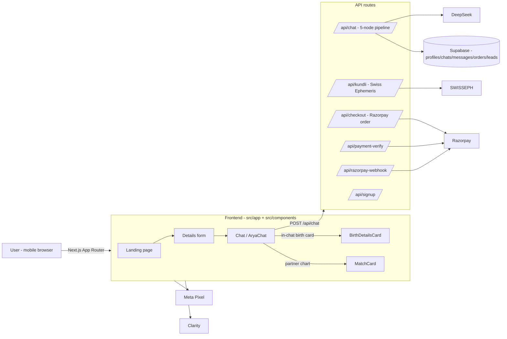
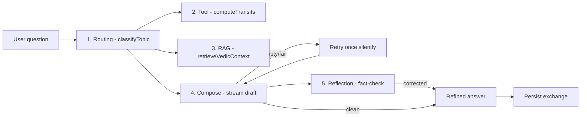
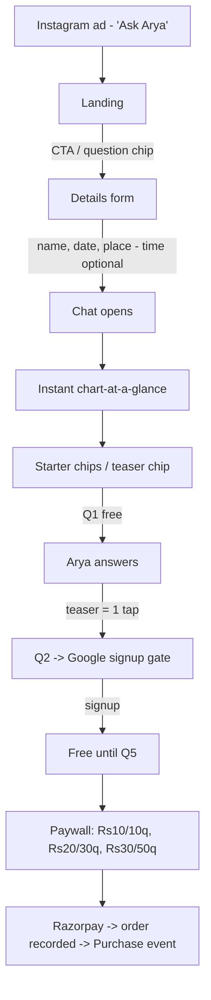

# Jyotish — Product, Architecture & Findings Report

**Product:** Jyotish — AI Vedic astrology chat (live at https://www.hiarya.in)
**Report date:** 5–6 August 2026
**Status:** ₹454 ad spend · 8 unique paying customers · ₹200 real revenue · funnel instrumentation + safety + panchang all live

---

## 1. Product overview

A mobile-first web app where users **chat with Arya**, an AI Vedic astrologer. The user asks a question (marriage, career, money, health), a real birth chart is computed (Swiss Ephemeris, sidereal/Lahiri), and Arya answers grounded in that chart, in the user's own language (English / Hinglish / Maralish).

Key facts:

| Area | Detail |
|---|---|
| Stack | Next.js 16 (App Router, TypeScript, Tailwind v4, Turbopack), next-intl |
| Chart engine | `swisseph-wasm` (server-side) |
| LLM | DeepSeek `deepseek-v4-flash` (reasoning, `reasoning_effort=low`) |
| Database | Supabase (Postgres, RLS) |
| Auth | Google Identity Services (gate) |
| Payments | Razorpay (live) |
| Tracking | Meta Pixel + Microsoft Clarity + Vercel Analytics |
| Hosting | Vercel (`aijothis`), GitHub `gotesgan/aijothis` |
| Languages | English, Hindi, Marathi |

---

## 2. System architecture

**Persistence model (Supabase):**

| Table | Purpose |
|---|---|
| `profiles` | One row per device: birth data, lang, `signed_up_at`, `paid20_at` (legacy) |
| `chats` | One row per conversation (per profile) |
| `messages` | Every user + assistant message (role, content, timestamps) |
| `orders` | Real payment records: amount, pack, order_id, payment_id, status |
| `leads` | UTM/referral capture from landing |

---

## 3. The 5-node AI pipeline (`/api/chat`)

- **Crisis guard first:** `detectCrisis` → caring reply (KIRAN/iCall helplines), no LLM call.
- **Optional match context:** when a partner chart is active, `ashtakoota()` scores both charts and the prompt is grounded in both.
- **Consistency:** prior timing statements from all earlier answers are injected; history window is 30 messages.
- **Retry:** a silent LLM retry + friendly fallback prevents blank replies.

---

## 4. The user funnel (as shipped)

Friction removed along the way:
- No "free" word anywhere in copy (CTA = **"Ask Arya"**).
- Landing chips carry the question (`?q=`) all the way to an auto-sent first message.
- Birth time is **optional** — auto-defaults to 12:00 PM with a "Rashi & Nakshatra stay reliable" note.
- Place selection has a guaranteed **"Use <city>"** escape hatch (never stuck on Google's overlay).
- The auto-opener was removed — chat opens with value instantly.

---

## 5. Everything shipped (commit log)

### 5.1 Today's commits (in order)

| Commit | Change | Why |
|---|---|---|
| `48c1f9a` | Funnel rebuild: "Ask Arya" CTA, question chips, instant chart-at-a-glance, details form cleanup | Fix ad/landing mismatch, faster first value |
| `7932bcd` | Context-aware starter chips + full Meta Pixel event set | Drive Q2, measure the funnel |
| `38a7919` | Microsoft Clarity + PII exclusion | See *why* users drop |
| `25130a6` | Glance ends with "ask me anything" | Prime the question |
| `d7dd438`→`f98abdc` | Punchy answers 60–80 → 90–110 words | Kill wall-of-text |
| `3c0ba52` | Removed auto-opener; starter chips show immediately | Openers satisfied users without a real question |
| `3208fdf` | Signup-gate refresh-bypass fix + answer-consistency rule | Users were skipping the gate by refreshing |
| `bc3755a` | Empty-reply retry + history 30 + prior timing-windows | Pratiksha got blank replies + contradictory windows |
| `4f14886` | **Kundli matching** (36-guna Ashtakoota, detection, MatchCard) | Pratiksha gave partner birth data; Arya used to guess |
| `ec04a36` | Practical & chart-bound answers, no-deception rule | Users want remedies, not astrology lessons |
| `9364b09` | Birth time optional (12:00 default) | A huge Indian cohort doesn't know birth time |
| `dea90aa` | Place fallback + Google login timeout (Clarity-driven) | Rage clicks on the form, dead-end login |
| `52e164f` | Purchase event: real-only + actual amount + `event_id` | Meta flagged "same price data" |
| `7e375ab` | `orders` table: record amount/pack/order/payment ids | Couldn't tell who paid what |
| `1727af9` | One-tap teaser chip + re-anchor rule | Q1→Q2 was the #1 leak |

### 5.2 Feature deep-dives

**Kundli matching (guna milan).** A user pasting a partner's birth details (e.g. Marathi: *"Mula cha janma tarik - 22/10/2003 naav - Sarthak janma vel - sakali 7:30 am"*) is detected, a MatchCard opens **pre-filled**, the partner's real chart is computed (without overwriting the user's profile), a **36-guna Ashtakoota** is scored (Varna 1, Vashya 2, Tara 3, Yoni 4, Graha Maitri 5, Gana 6, Bhakoot 7, Nadi 8), and Arya answers grounded in **both** charts + the score. A persistent *"Matching with <name>"* bar + clear button + match chip are included.

**Order recording.** New `orders` table captures `amount_paise`, `pack_id`, `pack_questions`, `order_id`, `payment_id`, `signature`, `status` (created / paid / simulated), `verified_at`. Wired into checkout, payment-verify, and the Razorpay webhook — non-breaking (graceful if the table is missing).

---

## 6. Tracking & analytics

### 6.1 Meta Pixel events

| Event | Type | Fires when |
|---|---|---|
| `PageView` | standard | Every SPA route change |
| `Lead` | standard | Birth details submitted, chart computed |
| `Signup` | custom | Google gate completed |
| `FirstAnswer` | custom | First question gets a real answer |
| `QuestionChip` | custom | Landing chip tapped (once per question) |
| `PaywallShown` | custom | Free limit hit, offer shown |
| `PackSelected` | custom | Pack tier chosen (value = ₹) |
| `InitiateCheckout` | standard | **Pay** button clicked |
| `Purchase` | standard | **Real** payment captured — `value` = actual order amount, `currency` = INR, `event_id` = uuid (CAPI-dedup ready) |
| `PaywallDismissed` | custom | "Not now" closes the paywall |

Simulated grants (dev/experiment) do **not** fire `Purchase` — only real money does.

### 6.2 Clarity
Session replays, heatmaps, click/scroll maps, rage-click detection. Birth fields are excluded from recordings (`data-exclude`).

---

## 7. Findings so far (data-backed)

### 7.1 Users & conversion (5 Aug 2026)

| User | Lang | Qs | Signed up | Paid |
|---|---|---|---|---|
| Totaram | en | 0 | – | – |
| Satyabrata Sahoo | en | 1 | – | – |
| मिलिंद कमलाकर काशीकर | mr | 1 | – | – |
| Chaman Khan | hi | 2 | – | – |
| **Pratiksha** | mr | **44** | ✅ | **₹30** |
| HARJINDER Singh | en | 1 | – | – |
| Stuti Sheth | hi | 1 | – | – |
| Guruprasad | mr | 1 | – | – |
| **Gourav Kumar** | hi | 8 | ✅ | **₹10** |

*(Test artifacts excluded.)*

### 7.2 Key findings

1. **The universal leak is Q1 → Q2.** Every user asked one question, got one answer, and dropped — before and after the opener removal. 7/8 never even reached the signup gate. → Fixed with the **one-tap teaser chip**.
2. **Crisis/problem-driven conversion.** Both payers had a *relationship crisis* (Pratiksha: love-vs-arranged + family pressure; Gourav: wife leaving 2 days after the wedding). Emotional need — not curiosity — converts. Both signed up and paid within ~5–10 minutes.
3. **Zero returning users.** No device has >1 chat; there is no re-engagement loop (no push, no daily-reading reminder). Retention is structurally 0.
4. **Starter chips work.** Gourav tapped the landing marriage chip + 3 Hindi starter chips in ~5 min before typing his real situation.
5. **Comprehension gap.** Pratiksha: *"Mla nakki kalat ch… tumhi khup confusion kartay"* — jargon + contradictory windows confused users. → Fixed (plain, chart-bound answers + consistency + re-anchor).
6. **Language split.** Marathi/Hindi users asked richer, more personal questions.

### 7.3 Bugs found in the wild (all fixed)

- **Empty replies** — Pratiksha got 4 blank answers during rapid-fire questions.
- **Contradictory timing windows** — Chaman (2027 vs Aug–Oct 2026), Pratiksha (multiple 2027/2028 windows). Root cause: history truncated to 12 messages.
- **Signup-gate refresh bypass** — asked-count was in-memory.
- **Deception** — Arya once coached lying to parents ("tell them guna milan < 18/36 even though it's false").
- **Form dead-ends** — Google Places overlay silent on some devices (rage clicks); Google login hung when Identity failed.
- **Purchase data quality** — simulated grants fired fake Purchase events at one price (Meta warning).
- **Blind order data** — couldn't tell who paid what until the `orders` table.

### 7.4 Real revenue (verified from Razorpay) — as of 6 Aug 2026, 18:00 UTC

| Customer | Packs | Amount |
|---|---|---|
| Gourav Kumar | p10 | **₹10** |
| Pratiksha | p30 ×3 | **₹90** |
| Shivangi | p20 | **₹20** |
| Praveen s Kumar | p20 | **₹20** |
| Pooja rajbhar | p20 | **₹20** |
| Bharat ral | p10 | **₹10** |
| Purnima | p10 | **₹10** |
| ganesh | p20 | **₹20** |
| **Total** | 10 orders / 8 unique payers | **₹200** |

*(Pratiksha actually paid ₹30, not ₹20 — the legacy `paid20_at` column name misled us. She has since bought twice more: 3× ₹30 total.)*

---

## 8. Known gaps / watch-outs

- **Sample too small** (2 days, ~22 real users, zero paid ad traffic) — patterns are directional, not conclusive.
- **No re-engagement loop** — nothing brings users back after their first session.
- **Google OAuth** may still fail silently until the consent screen is published + `hiarya.in` is added to OAuth origins in Google Cloud (code now degrades gracefully regardless).
- **Razorpay webhook** secret is set; the webhook URL should be confirmed active in the dashboard.
- **No server-side (Conversions API) events** yet — `event_id` on Purchase is ready for dedup when that's added.
- **RLS:** zero policies still on all tables (0002 staged) — fine until real auth is wired, but revisit before multi-user auth.

---

## 9. Recommended next steps

1. **Run the ₹2,500 ad test** on the current build (all fixes live).
2. **Watch Clarity replays** of the fixed flow (esp. post-teaser-chip Q1→Q2).
3. **Clean test data** from Supabase so attribution starts clean.
4. **Add a re-engagement loop** (daily reading reminder / resume-last-chat) to attack 0-return.
5. **Restore-chat UX** — returning users should resume their last thread, not start blank.
6. **Publish Google consent screen** + add OAuth origin.

## 10. Development update — 6 Aug 2026 (post-ad-launch)

### 10.1 The ad campaign is live

Campaign **"Arya | Maharashtra | Test 01"** (`ID 120248271176420438`): ₹454 spend, **ROAS 0.20**, 6 attributed purchases, 51 leads, 9 checkouts, 2,150 impressions, CTR 5.21%, CPC ₹4.06. **The funnel converts but unit economics don't — spend does not scale until ROAS ≥ 1.**

### 10.2 Shipped this session (all live in production)

| Commit | Change | Why |
|---|---|---|
| `1567a8e` | **p60 repeat-buyer plan** — ₹60 = unlimited questions for 7 days, shown **only** to users with a prior purchase (`jyotish_unlimited_until_v1`); `isUnlimited()` bypasses the question gate; checkout cap 5000→6000 paise | Upsell repeat buyers (Pratiksha/Purnima); LTV capture. Verified in-browser: repeat buyer sees p60, first-time buyer doesn't, active pass skips paywall |
| `b69c55b` | **Crisis guard hardening** — regex now catches spaced/variant self-harm ("kill my *self*", "best time to die", "ending it all", Marathi/Hindi variants) | A real user wrote *"kill my self… best time to die"* (6 Aug 16:30) and the guard **missed it** — only the LLM caught it. Verified: 11 crisis phrases caught, 0 false positives on relationship/career questions |
| `66272c1` | **Panchang / tithi / muhurat grounding** — `src/lib/panchang.ts` computes sidereal tithi/nakshatra/yoga/karana offline (validated against the drikPanchang production reference — reproduces tithi 22 Saptami, Mrigashira, Siddhi, karana Bava exactly); new `panchang` routing topic; lazy drikPanchang client (`DRIKPANCHANG_API_KEY`, cached, 5s timeout, fallback) for sunrise/sunset + rahu kalam | Tithi/muhurat questions get real data, not LLM guesses. Strictly lazy: API only for timing-intent, cache per date+place |

### 10.3 Live data (Supabase, 6 Aug 18:00 UTC)

- **100 profiles** (≈85 real), **97 chats, 1,218 messages**, 17 orders (10 paid + 7 abandoned).
- **~12 new signups in the final 45 min** of the session — traffic healthy.
- **Hot live session:** Manoj Deshpande (mr, Pune) in a long crisis-driven chat about "Suryakant" — rapid-fire "Hoo sanga" follow-ups. Same archetype as every payer.

### 10.4 Findings (updated)

1. **Repeat purchase is real.** Pratiksha bought **3× in 48 h** (₹90) — the crisis-binge pattern persists; she's the exact user p60 targets. She still chose p30 over the ₹60 unlimited (offer didn't convert her; 7-day framing may need to be more visible/compelling).
2. **Demand for tithi/muhurat is still unproven** — zero organic panchang questions across 1,200+ messages (the only hit was the Marathi false positive "stithi" = *situation*). The capability is live and correct; it will pay off only if users actually ask.
3. **Panchang cross-validation paid off** — my first karana formula was off by one (classical sequence starts at 6° elong, not 0°); the drikPanchang reference caught it. Free calc and API now agree.
4. **The crisis guard was the real gap** — a genuine self-harm message slipped through the hard guard and was caught only by the LLM. That's now fixed with no false positives.

### 10.5 Watch-outs

- **p60 hasn't sold yet.** Repeat buyers see it but keep buying packs. Consider: make p60 the highlighted default for repeat buyers, or drop to ₹49, before judging it.
- **ROAS 0.20.** Don't scale spend; iterate the funnel (details-form rage clicks + abandoned checkout are the open Clarity signals) or retarget with video per Meta's recommendation.
- **2 abandoned carts** open at session end (₹20 + ₹10).
- **drikPanchang key** is set locally; must be added to Vercel env vars to activate in production.
- **Google OAuth** consent screen still unpublished; **migrations 0002 + 0004** still not applied in the SQL editor.

---

*Diagrams rendered with Mermaid. Data pulled live from Supabase + Razorpay; all changes verified in-browser before shipping.*

